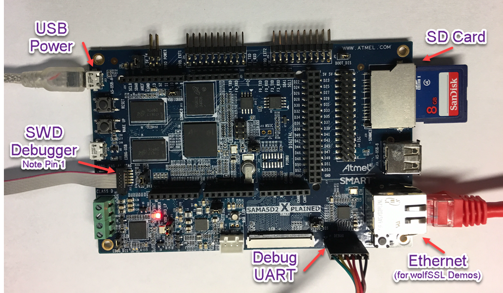

# Configuring the Hardware

Refer to the following image for an illustration for where to connect the cables to.

1. Connect the 10 pin debugger cable to the DEBUG SWD port.  Note that Pin 1 (red) is closest the USB ports
2. (For the wolfSSL demonstrations) connect an Ethernet cable to the Ethernet Port
3. Connect the 6 pin UART cable to the Debug UART port
3. Connect a Micro-USB B cable to the DEBUG USB port